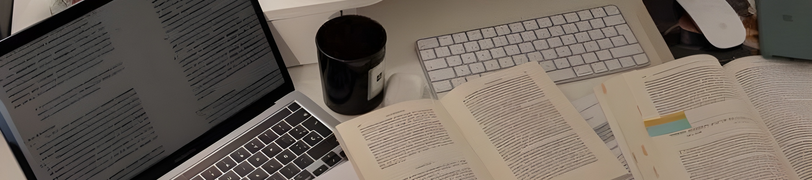

<p align="center">
  
</p>
<div align="center">

### Computer Science Student  
Università degli Studi di Milano

</div>

---
## 👩‍💻 About me

  ☁️  &emsp;Hello! I'm **Martina Marcolini**, a **20-year-old Computer Science student** at the **University of Milan**.</br>
      &thinsp;&ensp;&emsp;&emsp;I'm currently exploring different programming languages while building my first projects and gaining experience outside university.</br>
      &thinsp;&ensp;&emsp;&emsp;I enjoy solving problems, learning new technologies and improving my skills every day.</br>


---
## 💻 Tech Stack
<p>


</p>

---
## 📊 Statistics


---
## 🎯 Projects 

Projects will appear here soon 👀

```
Project Name
Short description
Technologies used
Repository link
```


---
## 🧩 Activities

• Volunteer at **AI Week 2025**  
• Volunteer at **AI Week 2026**

---
## 🥊 Sports

🐎 **Equestrian – Show Jumping** (11 years)  
🥋 **Boxing & Self Defense** (2 years)

Sports taught me discipline, focus and resilience — skills that also help me in programming.

---
### 📫 Contact

📧 marcolini.martina05@gmail.com

---

<div align="center">

⭐ Thanks for visiting my profile

</div>
